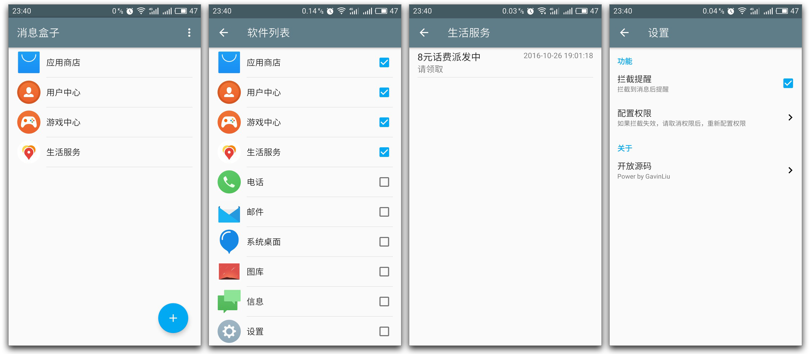

# NotificationBox

## Download

- [Github Release](https://github.com/gavinliu/NotificationBox/releases)

## Features

* Block notification
* Notification history list
* Support android device 19+

## Todo

* Save ``PendingIntent`` (save notification action)

## Acknowledgements

- [RxAndroid](https://github.com/ReactiveX/RxAndroid)
- [LiteOrm](https://github.com/litesuits/android-lite-orm)
- [android-architecture](https://github.com/googlesamples/android-architecture)

## License

MIT